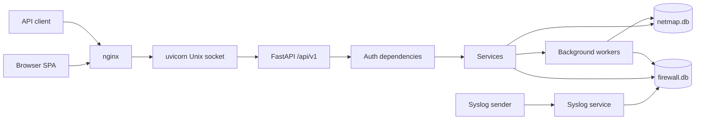

# Architecture

Verified source:

- App entrypoint: `backend/app/main.py`.
- API router mount: `app.include_router(api_router, prefix="/api/v1")`.
- nginx proxy: `docker/aio-nginx.conf.template`.
- entrypoint process supervision: `docker/aio-entrypoint.sh` and `tini`.
- main DB session: `backend/app/db/session.py`.
- firewall DB session: `backend/app/db/firewall_session.py`.

Background services start during FastAPI startup: syslog, alert monitor, scheduled discovery, IP reservation reminders, scheduled backups, and firewall startup maintenance.
