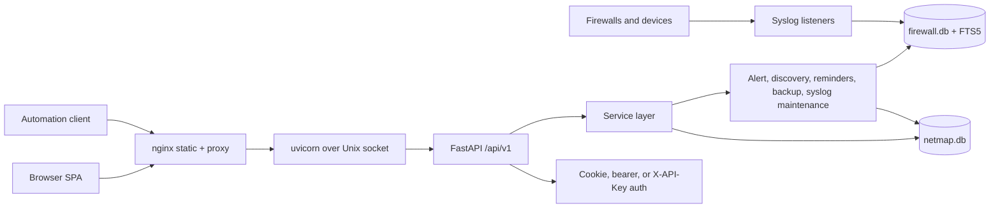

# Product Overview and Architecture

NetMap is a self-hosted network mapping and monitoring app for people who operate small and medium networks. It helps you keep an inventory of devices, map relationships between them, monitor uptime and service checks, manage IP address space, search syslog/firewall events, and export operational data.

NetMap is not a hosted SaaS product in this source tree. The supported packaging is a Docker-based self-hosted deployment, including an all-in-one image that runs nginx, the React SPA, FastAPI, background workers, syslog listeners, and SQLite storage in one container.

## Core Features

| Group | Verified features |
|---|---|
| Network inventory | Device CRUD, import, favourites, device types, sites, topology groups and VLAN metadata |
| Topology | Cytoscape-based graph, relationships, saved layouts, shared layout import, search, path highlighting, mini-map, bulk updates |
| Discovery | Manual nmap scans, scheduled discovery, private range validation, scheduled observations, import of discovered hosts |
| Monitoring | Fleet status summary, device monitoring rows, latency/history analysis, service checks and port targets |
| IPAM | Subnets, address grids, next available address, reservations, DHCP lease import, conflict detection, VLAN-to-subnet import |
| Security/syslog | UDP/TCP syslog ingestion, firewall event parsing/search, saved searches, event export, selected-device security summaries |
| Administration | Users, roles, permission matrix, settings, notification profiles, OIDC SSO configuration, diagnostics, backups |
| API and automation | OpenAPI schema, Swagger UI, API-key authentication, REST access to existing `/api/v1` routes |

## Target Users

NetMap is built for network administrators, homelab operators, security analysts, and support teams that need a local source of truth for device inventory, topology, monitoring, and syslog context.

## Architecture

Implementation notes verified from source:

- FastAPI is created in `backend/app/main.py`.
- API routers are mounted under `/api/v1` from `backend/app/api/v1/router.py`.
- The all-in-one image exposes HTTP on `APP_PORT`, default `8080`, plus syslog on `1514/tcp` and `1514/udp`.
- SQLite state is stored under `DATA_DIR`, default `/app/data`.
- Firewall/syslog events use a separate `firewall.db` to isolate high-volume syslog writes from the main app database.

## Screenshots

The repository includes screenshots under `assets/`:

| Screenshot | Description |
|---|---|
| `assets/netmap-lightmode.png` | Light-mode application overview. |
| `assets/netmap-darkmode.png` | Dark-mode application overview. |
| `assets/netmap-topology.png` | Topology canvas with network entities and links. |
| `assets/netmap-inventory.png` | Inventory workspace for device records. |
| `assets/netmap-ipam.png` | IPAM workspace for subnets and address management. |
| `assets/netmap-adminpanel.png` | Admin workspace for settings and management. |

Before publishing screenshots externally, confirm they do not expose real hostnames, IP ranges, usernames, secrets, or private network details.

## Supported Workflows

Common workflows include:

1. Deploy NetMap with Docker Compose.
2. Complete initial setup and create the first SuperAdmin.
3. Add devices manually or discover them with nmap.
4. Organize devices into sites, topology groups, and VLANs.
5. Draw device relationships and save/share topology layouts.
6. Monitor device availability and configure service checks.
7. Create alert rules and notification profiles.
8. Manage subnets, DHCP leases, reservations, and conflicts in IPAM.
9. Search and export firewall/syslog events.
10. Generate API keys and automate REST workflows.

## Terminology

| Term | Meaning |
|---|---|
| Device | A network entity tracked in inventory and topology. |
| Relationship | A link between two devices or groups in topology. |
| Group/VLAN | A topology grouping that can carry VLAN and subnet metadata. |
| Site | A physical or logical location attached to devices. |
| Service check | A monitored TCP/UDP port target associated with a device. |
| Observation | A scheduled-discovery finding that can be reviewed, applied, or resolved. |
| API key | A revocable secret that authenticates REST calls as the owning user. |
