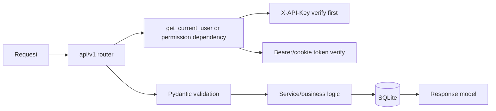

# Developer Guide

NetMap's end-user documentation describes the production v1.5.0 product. This section is the exception: it provides the source, validation, and contribution guidance needed to propose a change safely. Begin with the [Contributing Workflow](./contributing-workflow.md), which uses a personal fork and the `test` branch.

## Repository Structure

The source repository uses a conventional application layout:

```text
<repo-root>/
├── backend/        # FastAPI application
├── frontend/       # React SPA
├── docker/         # container build and nginx files
├── documentation/  # VitePress documentation site
├── docs/           # project design and architecture notes
└── scripts/        # release and maintenance scripts
```

Local development checkouts may include contributor-specific branch folders, local checkout folders, editor settings, or automation scripts. Those are not part of the public project structure.

## Backend

Stack:

- FastAPI
- SQLAlchemy
- SQLite
- Pydantic settings/schemas
- uvicorn

Request lifecycle:



Entry point: `backend/app/main.py`.

Router registration: `backend/app/api/v1/router.py`.

Authentication dependencies: `backend/app/api/deps.py`.

## Frontend

Stack:

- React 18
- TypeScript
- Vite
- Cytoscape.js
- Custom routing with `AppRoute`

Routes are defined in `frontend/src/routes/index.ts`. Workspaces live under `frontend/src/features/`.

## Local Validation

Backend tests:

```bash
cd <repo-root>/backend
env UV_CACHE_DIR=/tmp/uv-cache uv run --extra dev pytest tests
```

Frontend type check:

```bash
cd <repo-root>/frontend
npm exec tsc -- --noEmit
```

Frontend build:

```bash
cd <repo-root>/frontend
node node_modules/vite/bin/vite.js build
```

Build the all-in-one image from source:

```bash
cd <repo-root>
cp .env.example .env
docker compose -f docker-compose.build.yml up --build -d
curl --fail http://127.0.0.1:8080/api/health
```

## Adding An API Endpoint

1. Add or update Pydantic schemas under `backend/app/schemas/`.
2. Add route logic under the correct `backend/app/api/v1/*.py` router.
3. Use `get_current_user` for authenticated read routes.
4. Use an existing permission dependency for protected actions, or add a narrowly named permission in `services/rbac/permissions.py` and `api/deps.py`.
5. Add service-layer code when the logic is more than request/response orchestration.
6. Add tests for permissions, validation, success, and failure cases.
7. Regenerate/check `/api/openapi.json`.
8. Update this documentation.

API-key support is automatic for routes that use `get_current_user` or dependencies built on it. Do not add separate API-key parsing to individual route handlers.

## Adding A Model Or Migration

Current startup initializes and migrates SQLite through project DB startup code. When adding persistent data:

1. Add a SQLAlchemy model under `backend/app/models/`.
2. Ensure the model is imported by the model package or migration initializer.
3. Add migration/startup handling consistent with existing migration code.
4. Add tests covering new and existing databases.
5. Update backup/restore implications if new persistent files are introduced.

## Frontend UI Rules

Before changing styling, read:

- `docs/UI_THEME_RULES.md`
- `docs/design-system-preview.html`

Use shared `nm-*` classes where possible and verify light/dark states.

## Pull Request Expectations

Expected validation for code changes:

- Backend tests relevant to the change.
- Frontend `tsc --noEmit` for frontend changes.
- Vite build for frontend or all-in-one packaging changes.
- Documentation updates for behavior, API, configuration, or structure changes.

Submit changes from your fork's `test` branch to the upstream `test` branch. See [Contributing Workflow](./contributing-workflow.md) for the complete commands and review expectations. Contributors should not create production tags or publish official images.
