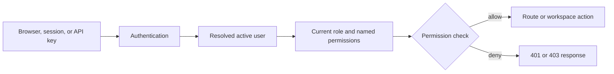

# Access-Control Model

NetMap separates authentication—proving who is calling—from authorization—deciding what that identity may do. This page is for administrators, API consumers, and security reviewers.

## Users and roles

Built-in roles are **SuperAdmin**, **NetworkAdmin**, **SecurityAnalyst**, and **Viewer**. Custom roles can combine named permissions. An active user may authenticate locally or through configured OIDC; deactivating the user removes access even if they previously created API keys.

## Sessions and API keys

Browser authentication uses a refresh cookie and an in-memory access token. A session can be revoked or expire. API keys are separate machine credentials: the plaintext is shown once, stored as a digest, and sent in `X-API-Key`. Keys inherit the owner's current role and permissions at request time; they do not have independent scopes.

SuperAdmins can revoke any key, while ordinary users can revoke only their own. API keys do not authenticate the syslog live WebSocket. Key use is rate-limited, failed lookups can trigger an IP lockout, and lifecycle actions are audited.

## Permission evaluation

The request path is:

A `401` means the caller was missing, invalid, expired, or revoked. A `403` means the identity was recognized but lacks the required permission. Ownership checks can add a narrower rule—for example, users cannot revoke another user's self-service key.

## Least privilege and recovery

Use a dedicated automation account with only the required permissions. Store API keys in a secret manager, rotate by create → deploy → verify → revoke, and audit suspicious activity. Keep a local SuperAdmin recovery path when SSO is required; do not remove the only active administrator.

## Related pages

- [Permissions](../security/permissions.md)
- [Security Model](../security/security-model.md)
- [API Keys](../api/api-keys.md)
- [OIDC SSO](../configuration/oidc-sso.md)
- [Authentication Problems](../troubleshooting/authentication-problems.md)
