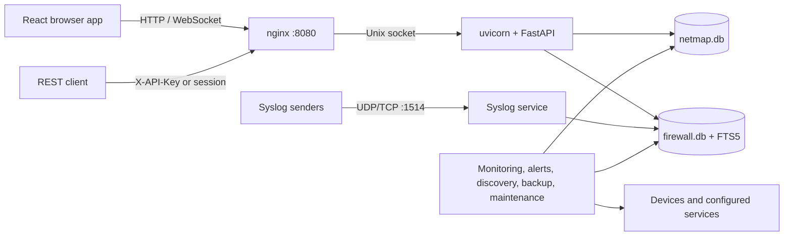
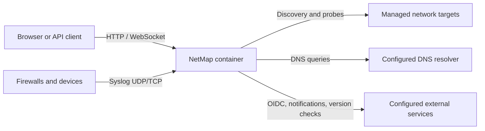
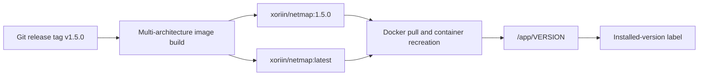

# How NetMap Works

This conceptual architecture is for evaluators, operators, reverse-proxy administrators, and contributors. Ordinary users need no special permission; system configuration and diagnostics generally require administrator or SuperAdmin access.

### Browser and API requests

nginx serves the compiled React single-page application and proxies `/api` and WebSocket traffic to uvicorn over `/tmp/uvicorn.sock`. FastAPI mounts product routes under `/api/v1`; `/api/health` is the unauthenticated container health endpoint.

Browser sessions use a refresh token in an HttpOnly cookie and keep the access token in memory. External clients may use API keys. Both resolve to a user whose current role and permissions are enforced by the same API dependencies.

### Data paths

Most configuration and operational records use `/app/data/netmap.db`. Firewall/syslog events and their full-text index use `/app/data/firewall.db`. Both databases use SQLite WAL mode and a busy timeout. The split prevents bursts of syslog writes from competing with every main-application transaction.

Uploads and generated persistent files also live below the configured data directory. A durable volume and backups are therefore prerequisites for production use.

### Active and passive services

- The **syslog service** passively listens for configured UDP/TCP input and parses accepted messages.
- **Discovery and tools** actively run network operations such as nmap, ping, DNS, and traceroute on user request or a schedule.
- **Monitoring workers** probe devices, ports, protocols, and HTTP endpoints.
- **Alert, reminder, and notification workers** evaluate saved configuration and may call external providers.
- **Maintenance workers** purge expired history in batches, maintain firewall search, and run scheduled backups.

These workers run with the API process; there is no separate distributed queue. A stopped container stops monitoring, discovery schedules, notifications, syslog reception, and maintenance until it restarts.

### The all-in-one image and persistent databases

The supported production image keeps nginx, uvicorn/FastAPI, the syslog listener, and background workers under one supervised container. nginx serves the SPA and proxies API/WebSocket traffic to uvicorn over `/tmp/uvicorn.sock`; the container exposes HTTP plus optional syslog listeners. Persistent state belongs under `/app/data`; `/tmp` and the Unix socket are runtime-only. Docker capabilities and host networking are added only when active probes or ARP/MAC discovery require them.

NetMap uses two SQLite databases. `netmap.db` stores users, settings, devices, topology, monitoring configuration, IPAM, alerts, and audit data. `firewall.db` stores high-volume syslog/firewall events and the `firewall_events_fts` full-text mirror. Both use WAL mode and busy timeouts, but the split prevents a syslog flood from contending with ordinary application writes. Firewall retention and FTS maintenance run in the background; confirmed whole-firewall corruption can recreate `firewall.db` while preserving the main database, so external backups remain essential.

### Startup and failure behavior

At startup NetMap validates the data directory and required production secrets, initializes both databases and built-in migrations, then starts services. nginx becomes useful only after the uvicorn socket and public health endpoint are ready. Invalid secrets or an unwritable data directory prevent a healthy start.

The firewall database has targeted recovery behavior: a damaged FTS index is rebuilt, while confirmed whole-database corruption causes `firewall.db` and its sidecars to be recreated, losing stored firewall history but preserving `netmap.db`. Always keep backups and inspect container logs after an unexpected rebuild.

For network exposure and probe requirements, see [Network Access and Capabilities](#network-access-and-capabilities). For operational backup and recovery procedures, see [Exports](../using-netmap/exports.md) and [Backups](../operations/backups.md).

## Network Access and Capabilities

NetMap is both a network listener and an active network client. This page is for deployers, network owners, and security reviewers. Only run discovery, diagnostics, or monitoring where you are authorized; relevant NetMap permissions are necessary but do not replace network-owner authorization.

### Traffic model

| Function | Direction | Default behavior |
|---|---|---|
| Browser/API | Inbound | HTTP on container `8080`; normally published behind HTTPS |
| Syslog | Inbound | UDP/TCP `1514`; TLS `6514` only when configured |
| Discovery | Outbound | nmap scans private ranges from the container; reverse DNS is enabled |
| Device monitoring | Outbound | ICMP with TCP fallback and configured service probes |
| HTTP monitors | Outbound | Requests configured URLs, optionally through a configured proxy |
| Tools | Outbound | User-triggered ping, traceroute, DNS, port, and SNMP operations |
| Notifications/OIDC/update checks | Outbound | When an integration is used/configured or the UI requests version status |

Arrows point in the direction in which the connection or datagram is initiated. Replies travel back over the corresponding request flow.

### Passive does not mean automatic

Syslog reception begins only when enabled and reachable, and network devices must be configured to forward messages to NetMap. Firewall rules and Docker port mappings must allow the selected protocol. NetMap does not passively capture arbitrary packets or discover devices by watching all traffic.

### Bridge mode versus host networking

Docker bridge mode is sufficient for many routed IP probes. It does not preserve LAN-layer visibility:

- ARP/MAC discovery does not cross the Docker bridge, so scans may find IPs without MAC addresses.
- DHCP service checks use `DHCPINFORM` from UDP port 68 and may be ignored when the container's route-selected address is outside the served scope.
- Source-IP allowlists and remote device rules see the container's effective network source, which may be translated.

Use `network_mode: host` when those functions require direct host/LAN behavior, after reviewing the larger exposure surface and removing incompatible `ports:` mappings. Host networking does not bypass host or upstream firewalls.

### Capabilities

The supplied image and Compose configuration provide the narrowly scoped privileges needed by network tools: `NET_RAW`, `NET_BIND_SERVICE`, a file capability on `ping`, and sudo permission for `/usr/bin/nmap`. If these are removed, ICMP may fall back to TCP, nmap discovery may fail, and DHCP checks may be unable to bind the client port.

### Scope and safety

Discovery accepts private IPv4/IPv6 CIDRs and ranges. Ranges are normalized before nmap runs. The default confirmation threshold is 256 hosts and the hard default maximum is 1,024 hosts; configuration can change these values. A ping sweep does not scan ports, and reverse-DNS delays count against the discovery process timeout.

Before enabling a probe:

1. confirm authorization and the exact target range;
2. verify routing, DNS, and firewall rules from the container namespace;
3. start with a small scope and conservative schedule;
4. observe fragile or rate-limited devices; and
5. disable the schedule or monitor if it causes load.

For hardening, see [Network Exposure](../security/network-exposure.md). For discovery procedures, see [Run Discovery](../guides/run-discovery.md).

## Production Images and Installed Versions

This page is for deployers and operators choosing an image or confirming what is running. Docker registry access is required to pull an image; viewing the installed version in NetMap requires a signed-in account.

### Published image

The production repository is `xoriin/netmap` on Docker Hub. Release builds target `linux/amd64` and `linux/arm64`.

| Tag style | Meaning | Recommended use |
|---|---|---|
| `xoriin/netmap:1.5.0` | Production release selected by semantic version | Production pinning and normal rollback planning |
| `xoriin/netmap:latest` | Most recently published production release | Convenience when an explicit pull-and-upgrade policy exists |
| `xoriin/netmap:test` | Build from the repository's test branch | Validation only; not a production release |
| SHA/branch metadata tags | CI traceability where published | Maintainer diagnostics, not normal deployment |

`latest` does not update a running container by itself. Pulling it later may resolve to a different image. Pin a version for normal change control; record the image digest as well when byte-for-byte reproducibility matters.

The label displayed by a running instance comes from the image that was actually started, not from the tag currently available at the registry.

### Authoritative installed version

The image bakes its version into `/app/VERSION`. The application reads this file for the sidebar, administration UI, and version API; an `APP_VERSION` environment value is fallback-only. This prevents an old environment override from falsely labeling a newer image.

Test and development images can also contain `/app/VERSION_CHANNEL`, producing labels such as `Test: 1.5.0`. A production release has no test/development channel label.

### Update information

When version status is requested, NetMap queries the GitHub tags API to compare the installed version with the newest release. The result is cached for an hour. The in-app **What's new** content prefers the changelog baked into the installed image and can fall back to that version's raw GitHub changelog. Failure to reach GitHub does not stop the application; update information may simply be unavailable.

An available update is not an automatic upgrade. Upgrading replaces the image and can run database migrations at startup. Back up first, read release notes, pull the intended tag, recreate the container, and verify health and data. Do not downgrade a migrated data directory unless a release explicitly documents it.

### Verify what is running

1. In NetMap, read the installed version shown in the sidebar or administration interface.
2. Compare the running container's image digest/tag with your deployment definition.
3. If they disagree, trust the baked installed-version label for application code and inspect whether the deployment reused a mutable tag without pulling.
4. Recreate with a pinned tag after a validated backup if deterministic versioning is required.

See [Upgrading](../installation/upgrading.md) and the [Product Changelog](../reference/changelog.md).

## Browser and Platform Support

This page is for users and deployers evaluating client and host compatibility. NetMap `v1.5.0` does not publish a formal browser-version matrix, so the boundaries below distinguish source requirements from what is continuously tested.

### Browser requirements

NetMap requires JavaScript, cookies, `fetch`, WebSocket support, local storage, modern CSS, and SVG rendering. Use a current desktop browser with security updates enabled.

- **Automated frontend coverage:** Chromium through Playwright.
- **Recommended baseline:** a current Chromium-based desktop browser.
- **Firefox and Safari:** expected to support most standards used by the app, but they are not part of the documented automated compatibility gate for `v1.5.0`.
- **Legacy browsers and Internet Explorer:** unsupported; the application is not transpiled or styled for them.

The UI uses features including `color-mix()`, dynamic viewport units (`dvh`), and a browser-specific directory picker for bulk icon import. A browser lacking one of these may show visual differences or omit directory selection even when core pages load.

### Cookies and storage

Do not use a mode or policy that blocks all cookies or site storage. Authentication relies on an HttpOnly refresh cookie plus a CSRF cookie, while preferences, column widths, local icon packs, topology cache/layout metadata, page sizes, and recent tool data may use local storage. Access tokens are kept in memory and are not stored in local or session storage.

Clearing site data signs the browser out and removes local-only preferences or icon packs. Server-side inventory and layouts remain unless explicitly deleted.

### Screen size and input

NetMap provides responsive rules, but topology canvases, dense monitoring tables, IPAM grids, and administration forms are designed primarily for a desktop-sized viewport and pointer/keyboard input. Small screens may require horizontal scrolling and are not a substitute for a full desktop workflow. There is no native mobile application.

Keyboard focus, dialogs, listboxes, and standard controls should remain usable, but no complete assistive-technology conformance claim is published for `v1.5.0`. Report inaccessible interactions through the project's [documentation issue tracker](https://github.com/xoriin/netmap-docs/issues).

### Server platform

Published Linux container images support `amd64` and `arm64`. The Docker host must support the image architecture, persistent writable storage, the selected network mode, and required capabilities. The browser can run on another operating system; only standards support and network access to NetMap matter.

### Troubleshooting compatibility

If a page is blank or controls fail, update the browser, enable JavaScript/cookies/site storage, disable content blockers for the NetMap origin, and retry in current Chromium. Check the browser console and NetMap logs before deleting site data. See [Common Issues](../troubleshooting/common-issues.md) and [Authentication Problems](../troubleshooting/authentication-problems.md).
