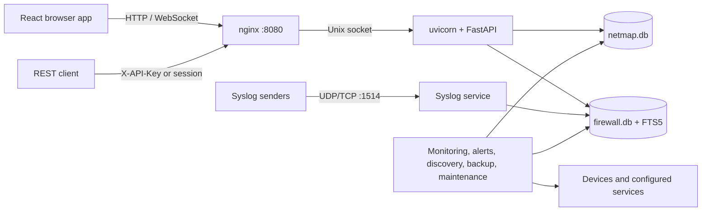

# How NetMap Works

This conceptual architecture is for evaluators, operators, reverse-proxy administrators, and contributors. Ordinary users need no special permission; system configuration and diagnostics generally require administrator or SuperAdmin access.

## Browser and API requests

nginx serves the compiled React single-page application and proxies `/api` and WebSocket traffic to uvicorn over `/tmp/uvicorn.sock`. FastAPI mounts product routes under `/api/v1`; `/api/health` is the unauthenticated container health endpoint.

Browser sessions use a refresh token in an HttpOnly cookie and keep the access token in memory. External clients may use API keys. Both resolve to a user whose current role and permissions are enforced by the same API dependencies.

## Data paths

Most configuration and operational records use `/app/data/netmap.db`. Firewall/syslog events and their full-text index use `/app/data/firewall.db`. Both databases use SQLite WAL mode and a busy timeout. The split prevents bursts of syslog writes from competing with every main-application transaction.

Uploads and generated persistent files also live below the configured data directory. A durable volume and backups are therefore prerequisites for production use.

## Active and passive services

- The **syslog service** passively listens for configured UDP/TCP input and parses accepted messages.
- **Discovery and tools** actively run network operations such as nmap, ping, DNS, and traceroute on user request or a schedule.
- **Monitoring workers** probe devices, ports, protocols, and HTTP endpoints.
- **Alert, reminder, and notification workers** evaluate saved configuration and may call external providers.
- **Maintenance workers** purge expired history in batches, maintain firewall search, and run scheduled backups.

These workers run with the API process; there is no separate distributed queue. A stopped container stops monitoring, discovery schedules, notifications, syslog reception, and maintenance until it restarts.

## Startup and failure behavior

At startup NetMap validates the data directory and required production secrets, initializes both databases and built-in migrations, then starts services. nginx becomes useful only after the uvicorn socket and public health endpoint are ready. Invalid secrets or an unwritable data directory prevent a healthy start.

The firewall database has targeted recovery behavior: a damaged FTS index is rebuilt, while confirmed whole-database corruption causes `firewall.db` and its sidecars to be recreated, losing stored firewall history but preserving `netmap.db`. Always keep backups and inspect container logs after an unexpected rebuild.

For process and port detail, see [Single-Container Architecture](./single-container-architecture.md). For exposure and probes, see [Network Access Model](./network-access-model.md).
