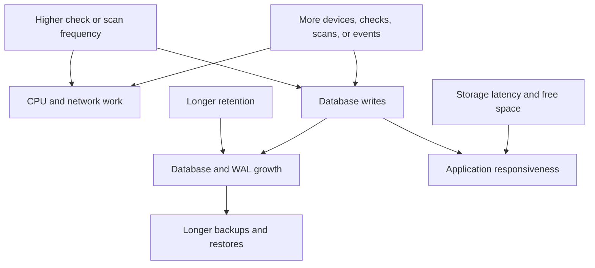

# Product Limitations and Capacity Planning

This page is for deployers and operators sizing a production instance. NetMap has no universal hardware sizing table or guaranteed maximum fleet size; test with representative inventory, checks, scan ranges, and event rates.

## Architectural limits

NetMap is one application container using two local SQLite databases. WAL mode, indexes, a busy timeout, short write transactions, batched retention, and database separation improve concurrency, but they do not turn SQLite into a clustered service. Run one active container per data directory and prefer local, reliable storage over network filesystems.

## Main capacity drivers

| Driver | What increases cost | Planning response |
|---|---|---|
| Syslog/firewall events | Senders, message rate, raw-log size, retention, full-text indexing | Limit senders, tune retention, monitor `firewall.db`, and export/archive elsewhere if required |
| Monitoring history | Device count, check count, frequency, retention | Start conservatively; retain only the history you use |
| HTTP monitors | Frequency, response latency, TLS/proxy work | Limit parallel expensive endpoints; responses are streamed only up to 2 MiB |
| Discovery | Address count, reverse DNS, nmap response time, schedule overlap | Use narrow private ranges and stagger schedules |
| Topology/UI | Device/link count and browser resources | Test representative layouts on operator hardware |
| Backups | Both DB sizes and attachment files | Budget temporary and destination space; test restore duration |

Capacity is the interaction of workload, retention, and host resources; device count alone is not a reliable sizing measure.

## Defaults that affect planning

- Monitoring-history and firewall-event retention default to **7 days**.
- Discovery defaults to a **60-second** process timeout, confirmation above **256** targets, and a hard maximum of **1,024** targets per scan.
- Raw syslog lines default to a maximum of **8,192 bytes**.
- TCP syslog and live-WebSocket connections each default to **50**.
- API keys default to **120 calls per 60 seconds** per key.

Administrators can change several values. Higher limits increase resource use and may expose devices to more aggressive probing; lower retention permanently removes older history.

## Disk planning

Mount `/app/data` on durable storage and monitor free space as well as database file size. SQLite deletion does not necessarily shrink the file immediately. Keep backup destinations outside the container's writable layer, account for Docker log rotation, and retain enough free space for WAL files, migrations, exports, and backup creation.

## Establish a baseline

1. Deploy with production-like storage and network paths.
2. Add a representative subset of devices, checks, and syslog sources.
3. Observe CPU, memory, DB growth, response time, scan duration, and backup duration for at least one retention cycle.
4. Extrapolate with margin and set alerts outside NetMap for host disk and container health.
5. Increase load gradually; retest after changing frequency, retention, or event sources.

If health degrades, pause schedules or monitors, reduce incoming syslog at the source, shorten retention with awareness of deletion, and preserve a backup before structural changes. Do not start a second container on the same data to add capacity.

See [The Two-Database Design](./two-database-design.md), [Monitoring NetMap](../operations/monitoring-netmap.md), and [Unsupported and Out-of-Scope Use Cases](./unsupported-use-cases.md).
