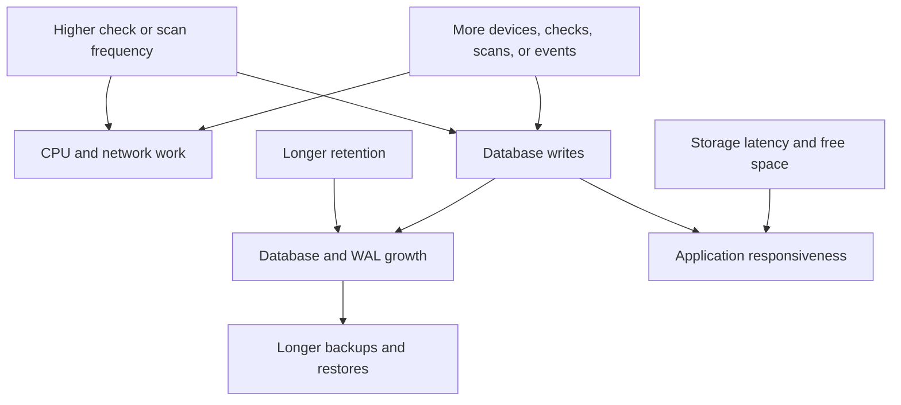
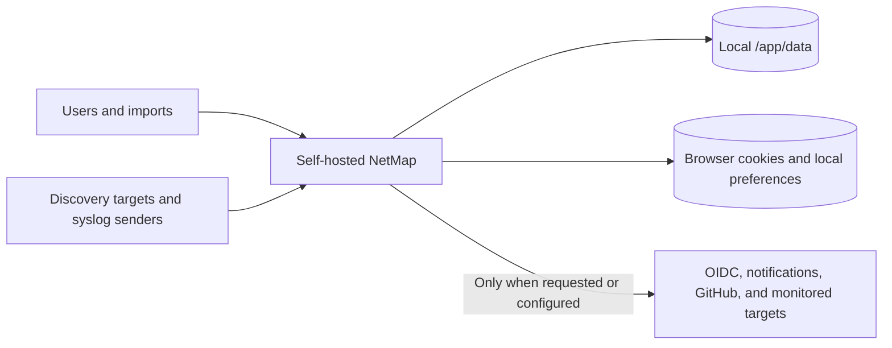
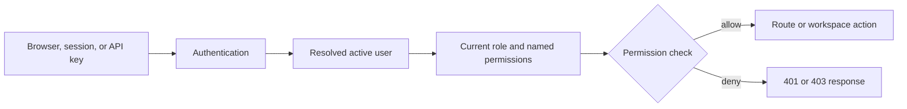

# Operating Boundaries and Administration

This page is for deployers and operators sizing a production instance. NetMap has no universal hardware sizing table or guaranteed maximum fleet size; test with representative inventory, checks, scan ranges, and event rates.

### Architectural limits

NetMap is one application container using two local SQLite databases. WAL mode, indexes, a busy timeout, short write transactions, batched retention, and database separation improve concurrency, but they do not turn SQLite into a clustered service. Run one active container per data directory and prefer local, reliable storage over network filesystems.

### Main capacity drivers

| Driver | What increases cost | Planning response |
|---|---|---|
| Syslog/firewall events | Senders, message rate, raw-log size, retention, full-text indexing | Limit senders, tune retention, monitor `firewall.db`, and export/archive elsewhere if required |
| Monitoring history | Device count, check count, frequency, retention | Start conservatively; retain only the history you use |
| HTTP monitors | Frequency, response latency, TLS/proxy work | Limit parallel expensive endpoints; responses are streamed only up to 2 MiB |
| Discovery | Address count, reverse DNS, nmap response time, schedule overlap | Use narrow private ranges and stagger schedules |
| Topology/UI | Device/link count and browser resources | Test representative layouts on operator hardware |
| Backups | Both DB sizes and attachment files | Budget temporary and destination space; test restore duration |

Capacity is the interaction of workload, retention, and host resources; device count alone is not a reliable sizing measure.

### Defaults that affect planning

- Monitoring-history and firewall-event retention default to **7 days**.
- Discovery defaults to a **60-second** process timeout, confirmation above **256** targets, and a hard maximum of **1,024** targets per scan.
- Raw syslog lines default to a maximum of **8,192 bytes**.
- TCP syslog and live-WebSocket connections each default to **50**.
- API keys default to **120 calls per 60 seconds** per key.

Administrators can change several values. Higher limits increase resource use and may expose devices to more aggressive probing; lower retention permanently removes older history.

### Disk planning

Mount `/app/data` on durable storage and monitor free space as well as database file size. SQLite deletion does not necessarily shrink the file immediately. Keep backup destinations outside the container's writable layer, account for Docker log rotation, and retain enough free space for WAL files, migrations, exports, and backup creation.

### Establish a baseline

1. Deploy with production-like storage and network paths.
2. Add a representative subset of devices, checks, and syslog sources.
3. Observe CPU, memory, DB growth, response time, scan duration, and backup duration for at least one retention cycle.
4. Extrapolate with margin and set alerts outside NetMap for host disk and container health.
5. Increase load gradually; retest after changing frequency, retention, or event sources.

If health degrades, pause schedules or monitors, reduce incoming syslog at the source, shorten retention with awareness of deletion, and preserve a backup before structural changes. Do not start a second container on the same data to add capacity.

See [How NetMap Works](./architecture.md#the-all-in-one-image-and-persistent-databases), [Monitoring NetMap](../operations/monitoring-netmap.md), and [What Is NetMap?](./what-is-netmap.md#where-netmap-fits).

## Configuration, Time, Retention, and Expiry

This page gives administrators and operators the mental model for settings that affect the whole instance. Exact variable names and defaults belong to the [Configuration Reference](../configuration/configuration.md) and [Default Values](../reference/default-values.md).

### Configuration ownership

| Source | Examples | Ownership and timing |
|---|---|---|
| Environment / secret file | `APP_URL`, database path, retention, listener ports, `SECRET_KEY`, `MASTER_KEY` | Container/operator controlled; many changes require restart. |
| Database system setting | OIDC overrides, notification and UI settings | SuperAdmin controlled; persisted in `netmap.db` and applied by the relevant service. |
| User preference | Theme, colors, layouts, table widths, page sizes | User/browser or account scoped; not a deployment setting. |
| Calculated state | Health, utilization, conflicts, latest monitor result | Derived from records and observations; do not edit as if it were source configuration. |

Secret-bearing fields such as OIDC client secrets, notification credentials, and sensitive HTTP-monitor options are encrypted with the master key and write-only through APIs. Losing the master key can make encrypted configuration unrecoverable; changing it is not a casual rotation.

### Time semantics

Stored timestamps represent UTC instants. SQLite can return naive datetime objects, so API responses re-stamp stored values as UTC before serialization. Clients should parse the offset and display in the operator's local timezone without changing the instant.

Scheduled discovery, monitoring history, API-key expiry, certificate warnings, retention, and session lifetime all compare timestamps to the server's current UTC time. A clock-skewed host can make these features appear early or late.

### Retention versus expiry

- **Retention** removes old history or events according to a policy; it is destructive and does not archive the rows.
- **Expiry** makes a credential, reservation, session, or other time-bounded record no longer valid after its deadline.
- **Disable/pause** changes active behavior without necessarily deleting history.

Back up before changing retention or deleting expired records, and verify host time with the container logs and an external clock source when schedules behave unexpectedly.

### Related pages

- [Configuration Reference](../configuration/configuration.md)
- [Environment Variables](../configuration/environment-variables.md)
- [Secrets Management](../security/secrets-management.md)
- [How NetMap Works](./architecture.md#the-all-in-one-image-and-persistent-databases)
- [Default Values](../reference/default-values.md)

## Privacy and Data Collection

NetMap is self-hosted and the `v1.5.0` source contains no built-in analytics or telemetry upload service. That does not mean it generates no network traffic or stores no sensitive data. This page is for deployers, privacy reviewers, administrators, and users; access to stored records is controlled by roles and permissions.

Most operational data remains on the NetMap host. The external path exists for specific features and is not a general telemetry stream.

### Data stored by the server

Depending on the features you use, `/app/data` can contain:

- usernames, email addresses, password hashes, roles, sessions, OIDC identity links, API-key metadata, and audit logs;
- device names, IP/MAC addresses, vendors, notes, locations, relationships, VLANs, subnets, DHCP leases, and public-IP allocations;
- scan definitions/results, discovery observations, health history, response times, service/HTTP monitor configuration, alert history, and notification deliveries;
- raw and parsed syslog/firewall messages, which may contain usernames, addresses, URLs, device identifiers, or other data supplied by senders;
- encrypted application secrets such as notification credentials, OIDC client secrets, and sensitive HTTP-monitor fields; and
- application-managed backup files created through enabled backup features.

Encryption of selected secrets does not encrypt the SQLite database as a whole. Protect the host, data directory, backups, logs, and `MASTER_KEY`; possession of both encrypted data and the key defeats that protection.

### Browser data

The browser receives an HttpOnly refresh cookie, a readable CSRF cookie, and an in-memory access token. Local storage may hold presentation preferences, table widths, page sizes, topology caches/metadata, local icon packs, and recent/saved tool values. It does not intentionally persist the current access token or monitoring fleet snapshots.

Anyone with access to the browser profile may see local-only preferences and tool history. Clear site data on a transferred or shared workstation, understanding that this signs the user out and removes local icon packs/preferences.

### Outbound requests

NetMap may make these outbound requests from the container:

| Destination | Trigger and data |
|---|---|
| GitHub API/raw content | Release-tag checks requested by the UI and changelog fallback; includes normal request metadata such as source IP and user agent |
| OIDC provider | Discovery, JWKS, authorization/token exchange, and provider tests when SSO is configured or used |
| Notification providers | Alert content and configured destination credentials for email, ntfy, Telegram, Signal, or Apprise-compatible services |
| Configured HTTP targets/proxy | Monitor request method, headers/body, authentication, certificates, and proxy settings chosen by an administrator |
| DNS and network targets | Discovery, monitoring, SNMP, ping, traceroute, DHCP, port, and DNS operations |

Provider behavior and retention are governed by those external systems. API keys and provider tokens should never be put into notes, screenshots, support bundles, or URLs.

### Inbound collection

NetMap records data that authorized users enter/import and traffic that configured senders deliver. Active discovery can collect addresses, hostnames, MACs, vendors, and observed services. It does not capture arbitrary packets from an interface and scheduled observations do not silently update inventory.

### Operator responsibilities

1. Collect only networks and logs you are authorized to process.
2. Use HTTPS, least-privilege roles, syslog allowlists, and restricted host/firewall exposure.
3. Set retention appropriate to operational and legal requirements; expiration permanently deletes history.
4. Protect and test backups, and securely remove retired copies.
5. Review notification bodies and external provider policies before sending sensitive event data.
6. Document local privacy notices and access procedures where required.

To reduce outbound traffic, leave optional integrations disabled, avoid external HTTP monitors, and block destinations at the network boundary with the understanding that update information, OIDC, or notifications will fail. See [Secrets Management](../security/secrets-management.md), [Network Exposure](../security/network-exposure.md), and [How NetMap Works](./architecture.md#the-all-in-one-image-and-persistent-databases).

## Access Control

NetMap separates authentication—proving who is calling—from authorization—deciding what that identity may do. This page is for administrators, API consumers, and security reviewers.

### Users and roles

Built-in roles are **SuperAdmin**, **NetworkAdmin**, **SecurityAnalyst**, and **Viewer**. Custom roles can combine named permissions. An active user may authenticate locally or through configured OIDC; deactivating the user removes access even if they previously created API keys.

### Sessions and API keys

Browser authentication uses a refresh cookie and an in-memory access token. A session can be revoked or expire. API keys are separate machine credentials: the plaintext is shown once, stored as a digest, and sent in `X-API-Key`. Keys inherit the owner's current role and permissions at request time; they do not have independent scopes.

SuperAdmins can revoke any key, while ordinary users can revoke only their own. API keys do not authenticate the syslog live WebSocket. Key use is rate-limited, failed lookups can trigger an IP lockout, and lifecycle actions are audited.

### Permission evaluation

The request path is:

A `401` means the caller was missing, invalid, expired, or revoked. A `403` means the identity was recognized but lacks the required permission. Ownership checks can add a narrower rule—for example, users cannot revoke another user's self-service key.

### Least privilege and recovery

Use a dedicated automation account with only the required permissions. Store API keys in a secret manager, rotate by create → deploy → verify → revoke, and audit suspicious activity. Keep a local SuperAdmin recovery path when SSO is required; do not remove the only active administrator.

### Related pages

- [Permissions](../security/permissions.md)
- [Security Model](../security/security-model.md)
- [API Keys](../api/api-keys.md)
- [OIDC SSO](../configuration/oidc-sso.md)
- [Authentication Problems](../troubleshooting/authentication-problems.md)
