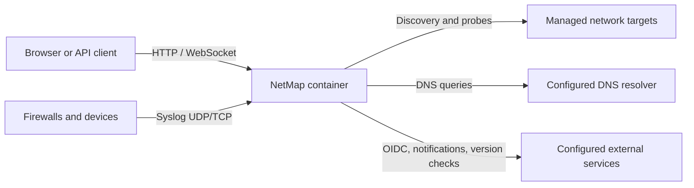

# Network Access Model

NetMap is both a network listener and an active network client. This page is for deployers, network owners, and security reviewers. Only run discovery, diagnostics, or monitoring where you are authorized; relevant NetMap permissions are necessary but do not replace network-owner authorization.

## Traffic model

| Function | Direction | Default behavior |
|---|---|---|
| Browser/API | Inbound | HTTP on container `8080`; normally published behind HTTPS |
| Syslog | Inbound | UDP/TCP `1514`; TLS `6514` only when configured |
| Discovery | Outbound | nmap scans private ranges from the container; reverse DNS is enabled |
| Device monitoring | Outbound | ICMP with TCP fallback and configured service probes |
| HTTP monitors | Outbound | Requests configured URLs, optionally through a configured proxy |
| Tools | Outbound | User-triggered ping, traceroute, DNS, port, and SNMP operations |
| Notifications/OIDC/update checks | Outbound | When an integration is used/configured or the UI requests version status |

Arrows point in the direction in which the connection or datagram is initiated. Replies travel back over the corresponding request flow.

## Passive does not mean automatic

Syslog reception begins only when enabled and reachable, and network devices must be configured to forward messages to NetMap. Firewall rules and Docker port mappings must allow the selected protocol. NetMap does not passively capture arbitrary packets or discover devices by watching all traffic.

## Bridge mode versus host networking

Docker bridge mode is sufficient for many routed IP probes. It does not preserve LAN-layer visibility:

- ARP/MAC discovery does not cross the Docker bridge, so scans may find IPs without MAC addresses.
- DHCP service checks use `DHCPINFORM` from UDP port 68 and may be ignored when the container's route-selected address is outside the served scope.
- Source-IP allowlists and remote device rules see the container's effective network source, which may be translated.

Use `network_mode: host` when those functions require direct host/LAN behavior, after reviewing the larger exposure surface and removing incompatible `ports:` mappings. Host networking does not bypass host or upstream firewalls.

## Capabilities

The supplied image and Compose configuration provide the narrowly scoped privileges needed by network tools: `NET_RAW`, `NET_BIND_SERVICE`, a file capability on `ping`, and sudo permission for `/usr/bin/nmap`. If these are removed, ICMP may fall back to TCP, nmap discovery may fail, and DHCP checks may be unable to bind the client port.

## Scope and safety

Discovery accepts private IPv4/IPv6 CIDRs and ranges. Ranges are normalized before nmap runs. The default confirmation threshold is 256 hosts and the hard default maximum is 1,024 hosts; configuration can change these values. A ping sweep does not scan ports, and reverse-DNS delays count against the discovery process timeout.

Before enabling a probe:

1. confirm authorization and the exact target range;
2. verify routing, DNS, and firewall rules from the container namespace;
3. start with a small scope and conservative schedule;
4. observe fragile or rate-limited devices; and
5. disable the schedule or monitor if it causes load.

For hardening, see [Network Exposure](../security/network-exposure.md). For discovery procedures, see [Run Discovery](../guides/run-discovery.md).
