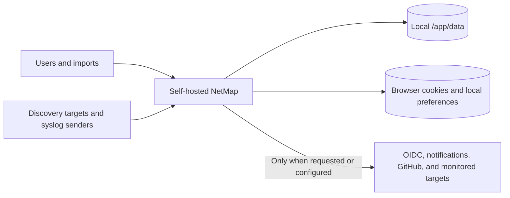

# Privacy and Data Collection

NetMap is self-hosted and the `v1.5.0` source contains no built-in analytics or telemetry upload service. That does not mean it generates no network traffic or stores no sensitive data. This page is for deployers, privacy reviewers, administrators, and users; access to stored records is controlled by roles and permissions.

Most operational data remains on the NetMap host. The external path exists for specific features and is not a general telemetry stream.

## Data stored by the server

Depending on the features you use, `/app/data` can contain:

- usernames, email addresses, password hashes, roles, sessions, OIDC identity links, API-key metadata, and audit logs;
- device names, IP/MAC addresses, vendors, notes, locations, relationships, VLANs, subnets, DHCP leases, and public-IP allocations;
- scan definitions/results, discovery observations, health history, response times, service/HTTP monitor configuration, alert history, and notification deliveries;
- raw and parsed syslog/firewall messages, which may contain usernames, addresses, URLs, device identifiers, or other data supplied by senders;
- encrypted application secrets such as notification credentials, OIDC client secrets, and sensitive HTTP-monitor fields; and
- application-managed backup files created through enabled backup features.

Encryption of selected secrets does not encrypt the SQLite database as a whole. Protect the host, data directory, backups, logs, and `MASTER_KEY`; possession of both encrypted data and the key defeats that protection.

## Browser data

The browser receives an HttpOnly refresh cookie, a readable CSRF cookie, and an in-memory access token. Local storage may hold presentation preferences, table widths, page sizes, topology caches/metadata, local icon packs, and recent/saved tool values. It does not intentionally persist the current access token or monitoring fleet snapshots.

Anyone with access to the browser profile may see local-only preferences and tool history. Clear site data on a transferred or shared workstation, understanding that this signs the user out and removes local icon packs/preferences.

## Outbound requests

NetMap may make these outbound requests from the container:

| Destination | Trigger and data |
|---|---|
| GitHub API/raw content | Release-tag checks requested by the UI and changelog fallback; includes normal request metadata such as source IP and user agent |
| OIDC provider | Discovery, JWKS, authorization/token exchange, and provider tests when SSO is configured or used |
| Notification providers | Alert content and configured destination credentials for email, ntfy, Telegram, Signal, or Apprise-compatible services |
| Configured HTTP targets/proxy | Monitor request method, headers/body, authentication, certificates, and proxy settings chosen by an administrator |
| DNS and network targets | Discovery, monitoring, SNMP, ping, traceroute, DHCP, port, and DNS operations |

Provider behavior and retention are governed by those external systems. API keys and provider tokens should never be put into notes, screenshots, support bundles, or URLs.

## Inbound collection

NetMap records data that authorized users enter/import and traffic that configured senders deliver. Active discovery can collect addresses, hostnames, MACs, vendors, and observed services. It does not capture arbitrary packets from an interface and scheduled observations do not silently update inventory.

## Operator responsibilities

1. Collect only networks and logs you are authorized to process.
2. Use HTTPS, least-privilege roles, syslog allowlists, and restricted host/firewall exposure.
3. Set retention appropriate to operational and legal requirements; expiration permanently deletes history.
4. Protect and test backups, and securely remove retired copies.
5. Review notification bodies and external provider policies before sending sensitive event data.
6. Document local privacy notices and access procedures where required.

To reduce outbound traffic, leave optional integrations disabled, avoid external HTTP monitors, and block destinations at the network boundary with the understanding that update information, OIDC, or notifications will fail. See [Secrets Management](../security/secrets-management.md), [Network Exposure](../security/network-exposure.md), and [The Two-Database Design](./two-database-design.md).
