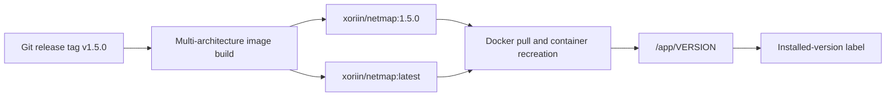

# NetMap Production Images and Installed Versions

This page is for deployers and operators choosing an image or confirming what is running. Docker registry access is required to pull an image; viewing the installed version in NetMap requires a signed-in account.

## Published image

The production repository is `xoriin/netmap` on Docker Hub. Release builds target `linux/amd64` and `linux/arm64`.

| Tag style | Meaning | Recommended use |
|---|---|---|
| `xoriin/netmap:1.5.0` | Production release selected by semantic version | Production pinning and normal rollback planning |
| `xoriin/netmap:latest` | Most recently published production release | Convenience when an explicit pull-and-upgrade policy exists |
| `xoriin/netmap:test` | Build from the repository's test branch | Validation only; not a production release |
| SHA/branch metadata tags | CI traceability where published | Maintainer diagnostics, not normal deployment |

`latest` does not update a running container by itself. Pulling it later may resolve to a different image. Pin a version for normal change control; record the image digest as well when byte-for-byte reproducibility matters.

The label displayed by a running instance comes from the image that was actually started, not from the tag currently available at the registry.

## Authoritative installed version

The image bakes its version into `/app/VERSION`. The application reads this file for the sidebar, administration UI, and version API; an `APP_VERSION` environment value is fallback-only. This prevents an old environment override from falsely labeling a newer image.

Test and development images can also contain `/app/VERSION_CHANNEL`, producing labels such as `Test: 1.5.0`. A production release has no test/development channel label.

## Update information

When version status is requested, NetMap queries the GitHub tags API to compare the installed version with the newest release. The result is cached for an hour. The in-app **What's new** content prefers the changelog baked into the installed image and can fall back to that version's raw GitHub changelog. Failure to reach GitHub does not stop the application; update information may simply be unavailable.

An available update is not an automatic upgrade. Upgrading replaces the image and can run database migrations at startup. Back up first, read release notes, pull the intended tag, recreate the container, and verify health and data. Do not downgrade a migrated data directory unless a release explicitly documents it.

## Verify what is running

1. In NetMap, read the installed version shown in the sidebar or administration interface.
2. Compare the running container's image digest/tag with your deployment definition.
3. If they disagree, trust the baked installed-version label for application code and inspect whether the deployment reused a mutable tag without pulling.
4. Recreate with a pinned tag after a validated backup if deterministic versioning is required.

See [Upgrading](../installation/upgrading.md), [Documentation Version and Product Compatibility](../about-documentation/documentation-version-compatibility.md), and the [Product Changelog](../reference/changelog.md).
