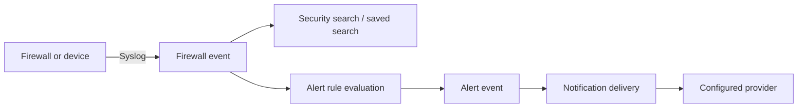

# Security Events and Notifications

This page is for security analysts and administrators interpreting event data and alert outcomes. Receiving syslog and changing notification profiles require the relevant security or administration permissions.

## Event records

A **firewall event** is parsed from an accepted syslog message and may contain event time, source/destination addresses and ports, protocol, action, interface, direction, rule/tracker IDs, reason, and the original raw log. Fields can be absent when the sender does not provide them. The raw log is searchable through the firewall FTS5 index.

**Saved searches** store a user's reusable filter intent; they do not copy event rows. The Security workspace searches broadly, while device-specific topology context is loaded on demand and scoped to the selected device IP.

## Alerts and deliveries

An **alert event** records that a rule fired, including rule name, event type, optional device, time, and message. A **notification delivery** records an attempt to send that alert to a channel or profile target with `sent` or `failed` status and a detail message. A fired alert and a successful notification are therefore separate outcomes.

## Storage and retention

Firewall events live in `firewall.db`, separate from the main application records. Retention permanently removes old event rows; provider-side copies and exported files are outside that policy. If FTS index corruption occurs, NetMap can rebuild the index; whole-firewall-database corruption recovery can lose firewall history.

## Related pages

- [Security Events workspace](../using-netmap/security-events.md)
- [Configure Syslog](../configuration/syslog.md)
- [Search Syslog Events](../guides/search-syslog.md)
- [Create an Alert Rule](../guides/create-alert-rule.md)
- [How NetMap Works](./architecture.md#the-all-in-one-image-and-persistent-databases)
