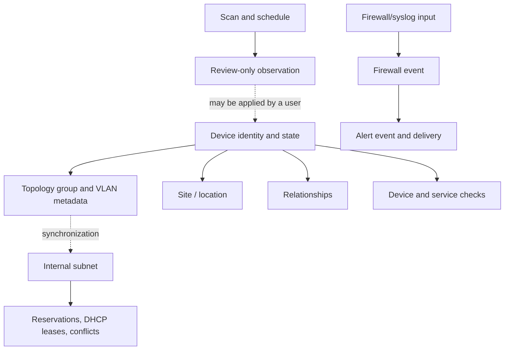
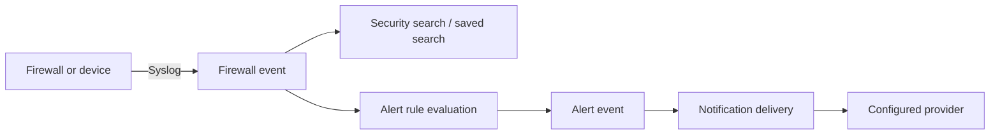

# NetMap Data Model

This is the canonical vocabulary page for readers, administrators, and API users. It explains how NetMap's records relate; detailed behavior belongs to the linked concept pages and task guides.

### Core terms

| Term | Meaning |
|---|---|
| **Device** | A tracked network endpoint or infrastructure asset. A device may have an IP, MAC address, hostname, vendor, type, tags, notes, and topology membership. |
| **Identity** | The fields used to describe and match a device: IP, MAC, hostname, display name, vendor, operating system, and type. |
| **Relationship** | A directed or bidirectional topology link between devices. It can carry a type, notes, direction flags, and an optional manual link speed. |
| **Topology group** | A logical canvas container for devices. It can carry VLAN and subnet metadata and may be inferred from a device's group name. |
| **VLAN** | VLAN identifier and related network metadata stored with a topology group; it is not a switch configuration pushed by NetMap. |
| **Site / location** | A physical or logical place attached to devices and used for organization, filtering, and display. |
| **Subnet** | An internal IPv4 or IPv6 network range managed by IPAM. |
| **Reservation** | An IPAM record marking an address for a device or intended use. |
| **DHCP lease** | Imported lease information used as an IPAM data source; importing does not request, renew, or release a lease. |
| **Conflict** | An IPAM condition such as duplicate use, overlap, gateway collision, or reservation/DHCP inconsistency that needs review. |
| **Device check** | Reachability monitoring for an inventory device, with observed health and latency/history. |
| **Service check** | A device-associated TCP/UDP or protocol check. |
| **HTTP monitor** | A standalone HTTP/HTTPS endpoint monitor that is independent of an inventory device. |
| **Discovery scan** | An nmap operation against an authorized private target range. |
| **Schedule** | Configuration that runs discovery repeatedly and records its latest run. |
| **Observation** | A review-only finding produced by scheduled discovery; it does not silently change inventory. |
| **Firewall event** | A parsed or raw syslog record stored in the separate firewall database. |
| **Alert event** | A record that an alert rule fired. |
| **Notification delivery** | The attempt to send an alert through a configured target, recorded as sent or failed. |
| **Session** | Server-side authentication state associated with a browser or access token. |
| **API key** | A revocable secret authenticating REST requests as its owning user through `X-API-Key`. |

### How records relate

The dotted paths are conditional relationships, not automatic ownership. For example, a group may synchronize metadata to a canonical subnet, and a user may apply an observation to inventory after review.

### Naming and state rules

The UI may show a display name while APIs and matching logic use stable IDs and identity fields. A device's observed health is not the same thing as its expected status, lifecycle, or monitoring pause state. Use the [Device Records and State](#device-records-and-state) section when interpreting status.

For exact API fields, see the [Endpoint Inventory](../api/api-reference.md). For a compact compatibility entry, see the [Reference Glossary](../reference/glossary.md).

### Related concepts

- [Topology Entities](#topology-entities)
- [Internal IPAM Data Model](#internal-ipam)
- [Monitoring and Discovery Data Model](#monitoring-and-discovery)
- [Security Events and Notifications](#security-events-and-notifications)
- [Access-Control Model](../security/permissions.md)
- [Configuration, Time, Retention, and Expiry](../configuration/configuration.md)

## Device Records and State

This page is for users and administrators maintaining inventory or interpreting device health. Editing records requires the relevant inventory permission; viewing status depends on workspace access.

### Device identity

| Field | Meaning and behavior |
|---|---|
| Display name | Human-friendly label used in the interface; it may differ from the hostname. |
| Hostname | DNS or discovery name, retained separately from the display name. Reverse DNS may populate discovery results. |
| IP address | Normalized IPv4 or IPv6 address. It is an identity attribute, not proof that the device is reachable. |
| MAC address | Layer-2 identity when discovered or entered. ARP/MAC discovery requires suitable network access. |
| Vendor / operating system | Descriptive or enriched fields; they are not guaranteed for every device. |
| Device type | A built-in or configured classification such as router, switch, server, or camera. |
| Tags and notes | Operator metadata; tags are normalized and deduplicated. |

Discovery can match a host by MAC when available, detect an IP move, and produce a review observation. Matching is not a license to overwrite inventory: scheduled findings remain review-only until applied.

### Four different state concepts

| Concept | Allowed values / meaning | What it answers |
|---|---|---|
| Observed health | `healthy`, `unhealthy`, `unknown`, or `paused` after expected/lifecycle rules are applied | What monitoring currently concludes |
| Expected status | `online` or `offline` | Is reachability expected for this device? |
| Lifecycle | `planned`, `active`, `retired`, or `ignored` | Should this record be treated as part of the active fleet? |
| Monitoring paused | Boolean control layered over health | Should active monitoring be temporarily suppressed? |

An intentionally offline device can be reachable and still be healthy relative to its expectation. A retired or paused device must not be interpreted as an outage. Consumers should use the server-returned `health_status` or the frontend health utility, not raw `status` or `monitor_status` values.

### Empty and changed fields

An empty hostname, MAC, vendor, or OS field means that value is unknown or was not supplied; it is not proof that the device lacks the property. An IP or MAC change may come from DHCP, a replacement device, a discovery mismatch, or an incomplete scan. Review the source scan and observation details before applying a change.

### Related pages

- [Inventory](../using-netmap/inventory.md)
- [Add a Device](../guides/add-device.md)
- [Review Discovery Observations](../guides/scheduled-discovery-observations.md)
- [Monitoring and Discovery Data Model](#monitoring-and-discovery)
- [NetMap Terminology and Data Model](./terminology.md)

## Topology Entities

This page explains how topology records fit together. Users can view maps according to permission; creating groups, sites, or relationships requires the corresponding write permission.

### Groups and VLANs

A topology group is a logical container used to organize devices on the canvas. Group metadata may include a VLAN ID, subnet CIDR, gateway, DNS, description, and color. NetMap stores this as operational metadata; it does not configure a switch, router, VLAN, or DHCP server.

When a device carries a group name without a `topology_group_id`, the UI may show inferred membership. Name matching is a fallback for display and should not be confused with a foreign-key assignment.

Group edits can synchronize metadata to one canonical internal IPAM subnet. If multiple subnet rows match a group's CIDR and VLAN, the row already using that group CIDR is preferred. This prevents a DNS-only group edit from creating duplicate CIDRs.

### Sites and locations

A site is a physical or logical location with a name, optional display name, description, address, and color. Site membership is independent of topology-group membership: one device can belong to a site and a group, or neither. Sites support organization, filtering, and visual context; they do not define network reachability.

### Relationships

A relationship connects a source device to a target device and may include:

- a free-form relationship type;
- `allow_outbound` and `allow_inbound` direction flags;
- notes; and
- an optional manual `link_speed_mbps` value from 1 to 1,000,000.

Direction flags describe the modeled relationship, not packet inspection. Link speed is operator-entered metadata used for edge labels and visual width; it is not negotiated or measured by NetMap.

Topology can also represent containment-like hops between devices and parent zones during path highlighting. A drawn edge is not required for every visual relationship shown on the canvas.

### Deletion and consistency

Deleting a group or site may leave devices without that association, depending on the relationship's delete behavior. Deleting a relationship removes the map edge but does not delete either device. Before bulk updates or group synchronization, confirm the selected records and review the resulting IPAM metadata.

### Related pages

- [Topology workspace](../using-netmap/topology.md)
- [VLANs and Groups](../using-netmap/vlans.md)
- [Locations](../using-netmap/locations.md)
- [Share a Topology Layout](../guides/share-topology-layout.md)
- [Internal IPAM Data Model](#internal-ipam)

## Internal IPAM

This page is for network operators managing private address space. IPAM write actions require the relevant permission; imported lease data must come from a system you are authorized to read.

### The records

| Record | Purpose |
|---|---|
| Subnet | Defines an IPv4/IPv6 CIDR, name, description, gateway, DNS, VLAN, and related metadata. |
| Device address | An address present on an inventory device and counted against matching subnets. |
| Reservation | An address intentionally reserved for a device or purpose. |
| DHCP lease | Imported observed lease data with address and lease-state information. Import does not communicate with DHCP. |
| Conflict | A calculated condition requiring review, such as duplicate address use, overlap, gateway collision, or reservation/lease inconsistency. |

Subnet membership is calculated from normalized numeric IPv4/IPv6 indexes. A record can therefore be counted even when its source fields use different textual formatting. Network and broadcast addresses are treated according to IPAM's address-grid rules rather than assumed to be assignable host addresses.

### Utilization is a view, not a lease

The address grid combines known devices, leases, reservations, and system-reserved addresses. “Free” means no tracked object currently claims the address under the view's rules; it does not guarantee that DHCP, a router, or another untracked system will allow it.

### Conflicts and synchronization

Overlapping subnet definitions, duplicate CIDRs, a gateway inside an incompatible range, duplicate assignments, and VLAN-to-subnet metadata mismatches are different conditions. Resolve the source record rather than deleting a warning blindly. Group/VLAN synchronization chooses one canonical subnet row and may update its metadata; it does not merge arbitrary address allocations.

### Safe workflow

1. Create or verify the subnet CIDR and gateway.
2. Confirm the VLAN/group association and intended DNS metadata.
3. Import DHCP leases from a trusted export if needed.
4. Review utilization and conflicts against device and reservation records.
5. Resolve duplicates or overlaps before creating new reservations.
6. Recheck the address grid after each correction.

Deleting a subnet or reservation can remove the organizing record while leaving external systems unchanged. Export or back up before destructive cleanup.

### Related pages

- [IPAM workspace](../using-netmap/ipam.md)
- [Create an IP Reservation](../guides/create-ip-reservation.md)
- [Import DHCP Leases](../guides/import-dhcp-leases.md)
- [VLAN and IPAM synchronization](../using-netmap/vlans.md)
- [External IP Pools and Assignments](#external-ip-pools-and-assignments)

## External IP Pools and Assignments

External IP tracking is for administrators and operators who manage provider-assigned public addresses. It is separate from internal subnet IPAM and does not configure a provider, router, or firewall.

### Pool versus assignment

An **external IP pool** represents a provider allocation or public CIDR/range. An **assignment** records one address from that pool with a label and optional provider, account, owner, service, tags, and notes. Assignment status distinguishes operational use such as `in_use` and `reserved`.

### Validation rules

- Private, loopback, link-local, multicast, and other special-purpose ranges are rejected.
- Overlapping external allocations are blocked.
- An assignment must belong to a pool and remain inside that pool.
- An address cannot be assigned twice.
- Resizing or deleting a pool cannot orphan an existing assignment.

These checks protect the inventory model; they do not prove that a provider has actually routed the address or that a service is reachable from the Internet.

### Planning example

Record the provider's public allocation as a pool, then create assignments for addresses used by a reverse proxy, mail service, VPN, or reserved future service. Keep provider account and ownership fields current enough for incident response, and avoid putting credentials in notes.

### Related pages

- [IPAM workspace](../using-netmap/ipam.md)
- [Privacy and Data Collection](../security/security.md#privacy-and-data-boundaries)
- [Network Exposure](../security/network-exposure.md)
- [Internal IPAM Data Model](#internal-ipam)

## Monitoring and Discovery

NetMap has separate records for observing an existing inventory and finding possible changes. This page is for operators planning checks or reviewing discovery results.

### Monitoring layers

| Layer | Attached to | What it records |
|---|---|---|
| Device check | Inventory device | Reachability, expected status, health, latency, and history. |
| Service check | Device and configured target | TCP/UDP or protocol-specific availability for a service. |
| Standalone HTTP monitor | URL, independent of inventory | HTTP method, status range, assertions, TLS, authentication, proxy, retries, and response history. |

An HTTP monitor is not automatically a device record. Sensitive headers, bodies, tokens, proxy URLs, certificates, and keys are encrypted and write-only; APIs expose presence flags rather than plaintext.

### Discovery records

- A **scan** is one nmap execution with a target, scan type, status, host/result counts, results, and error/completion times.
- A **schedule** owns recurring target and notification configuration, interval, latest run, and next-run state.
- An **observation** is a review record produced by comparing scheduled results with inventory. Types include new device, IP move, changed fields, and disappeared host.

Observations are not inventory mutations. A user can apply, resolve, or leave one open. Disappeared-host observations require three consecutive missed scheduled scans. A reappearing host can auto-resolve an open disappearance finding and suppress noisy re-raising within the configured churn window.

### What a scan does not prove

A ping sweep does not scan ports. Reverse DNS may add a hostname and may also add delay. A discovered host is not automatically trusted, imported, monitored, or assigned to a group. Discovery only sees targets reachable from the container with its current network mode and capabilities.

### Related pages

- [Monitoring](../using-netmap/monitoring.md)
- [Configure Service Checks](../guides/configure-service-checks.md)
- [Run Discovery](../guides/run-discovery.md)
- [Review Discovery Observations](../guides/scheduled-discovery-observations.md)
- [Network Access Model](../product-introduction/architecture.md#network-access-and-capabilities)

## Security Events and Notifications

This page is for security analysts and administrators interpreting event data and alert outcomes. Receiving syslog and changing notification profiles require the relevant security or administration permissions.

### Event records

A **firewall event** is parsed from an accepted syslog message and may contain event time, source/destination addresses and ports, protocol, action, interface, direction, rule/tracker IDs, reason, and the original raw log. Fields can be absent when the sender does not provide them. The raw log is searchable through the firewall FTS5 index.

**Saved searches** store a user's reusable filter intent; they do not copy event rows. The Security workspace searches broadly, while device-specific topology context is loaded on demand and scoped to the selected device IP.

### Alerts and deliveries

An **alert event** records that a rule fired, including rule name, event type, optional device, time, and message. A **notification delivery** records an attempt to send that alert to a channel or profile target with `sent` or `failed` status and a detail message. A fired alert and a successful notification are therefore separate outcomes.

### Storage and retention

Firewall events live in `firewall.db`, separate from the main application records. Retention permanently removes old event rows; provider-side copies and exported files are outside that policy. If FTS index corruption occurs, NetMap can rebuild the index; whole-firewall-database corruption recovery can lose firewall history.

### Related pages

- [Security Events workspace](../using-netmap/security-events.md)
- [Configure Syslog](../configuration/syslog.md)
- [Search Syslog Events](../guides/search-syslog.md)
- [Create an Alert Rule](../guides/create-alert-rule.md)
- [How NetMap Works](./architecture.md#the-all-in-one-image-and-persistent-databases)
