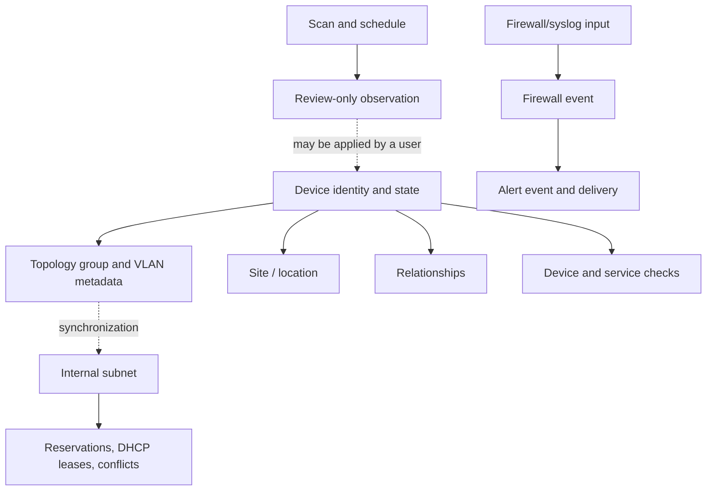

# NetMap Terminology and Data Model

This is the canonical vocabulary page for readers, administrators, and API users. It explains how NetMap's records relate; detailed behavior belongs to the linked concept pages and task guides.

## Core terms

| Term | Meaning |
|---|---|
| **Device** | A tracked network endpoint or infrastructure asset. A device may have an IP, MAC address, hostname, vendor, type, tags, notes, and topology membership. |
| **Identity** | The fields used to describe and match a device: IP, MAC, hostname, display name, vendor, operating system, and type. |
| **Relationship** | A directed or bidirectional topology link between devices. It can carry a type, notes, direction flags, and an optional manual link speed. |
| **Topology group** | A logical canvas container for devices. It can carry VLAN and subnet metadata and may be inferred from a device's group name. |
| **VLAN** | VLAN identifier and related network metadata stored with a topology group; it is not a switch configuration pushed by NetMap. |
| **Site / location** | A physical or logical place attached to devices and used for organization, filtering, and display. |
| **Subnet** | An internal IPv4 or IPv6 network range managed by IPAM. |
| **Reservation** | An IPAM record marking an address for a device or intended use. |
| **DHCP lease** | Imported lease information used as an IPAM data source; importing does not request, renew, or release a lease. |
| **Conflict** | An IPAM condition such as duplicate use, overlap, gateway collision, or reservation/DHCP inconsistency that needs review. |
| **Device check** | Reachability monitoring for an inventory device, with observed health and latency/history. |
| **Service check** | A device-associated TCP/UDP or protocol check. |
| **HTTP monitor** | A standalone HTTP/HTTPS endpoint monitor that is independent of an inventory device. |
| **Discovery scan** | An nmap operation against an authorized private target range. |
| **Schedule** | Configuration that runs discovery repeatedly and records its latest run. |
| **Observation** | A review-only finding produced by scheduled discovery; it does not silently change inventory. |
| **Firewall event** | A parsed or raw syslog record stored in the separate firewall database. |
| **Alert event** | A record that an alert rule fired. |
| **Notification delivery** | The attempt to send an alert through a configured target, recorded as sent or failed. |
| **Session** | Server-side authentication state associated with a browser or access token. |
| **API key** | A revocable secret authenticating REST requests as its owning user through `X-API-Key`. |

## How records relate

The dotted paths are conditional relationships, not automatic ownership. For example, a group may synchronize metadata to a canonical subnet, and a user may apply an observation to inventory after review.

## Naming and state rules

The UI may show a display name while APIs and matching logic use stable IDs and identity fields. A device's observed health is not the same thing as its expected status, lifecycle, or monitoring pause state. Use the dedicated [Device Records and State](./device-records-and-state.md) page when interpreting status.

For exact API fields, see the [Endpoint Inventory](../api/api-reference.md). For a compact compatibility entry, see the [Reference Glossary](../reference/glossary.md).

## Related concepts

- [Topology Entities](./topology-entities.md)
- [Internal IPAM Data Model](./ipam-data-model.md)
- [Monitoring and Discovery Data Model](./monitoring-and-discovery-model.md)
- [Security Events and Notifications](./security-events-and-notifications.md)
- [Access-Control Model](./access-control-model.md)
- [Configuration, Time, Retention, and Expiry](./configuration-time-and-retention.md)
