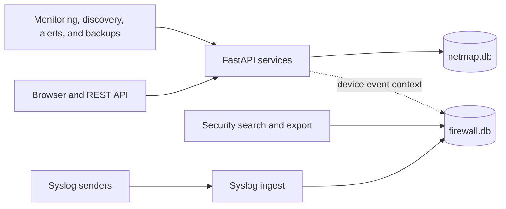

# The Two-Database Design

NetMap stores state in two SQLite databases under `/app/data`. This page is for operators planning storage, retention, backup, or recovery. Reading it requires no role; diagnostics and backup controls require elevated application permissions, while filesystem work requires Docker host access.

| Database | Primary contents | Operational characteristic |
|---|---|---|
| `netmap.db` | Users, sessions, inventory, topology, IPAM, discovery, monitoring configuration/history, alerts, settings, and audit records | Main application transactions and relationships |
| `firewall.db` | Parsed firewall/syslog events and the FTS5 raw-log search index | Potentially bursty, high-volume ingest and retention |

The solid paths show the usual write and query flows. The dotted path represents selected application views that read device-specific event context without moving those events into the main database.

## Why they are separate

Syslog senders can produce sustained write bursts. Keeping their events in `firewall.db` prevents that workload from sharing every write lock with inventory, authentication, layout saves, and monitoring configuration. It also allows firewall search-index recovery without replacing the main application database.

The split is isolation, not replication: neither file is a copy of the other, and a complete backup needs both when firewall history matters.

## SQLite behavior

Both databases use WAL mode, `synchronous=NORMAL`, and a 20-second busy timeout. The main engine uses a bounded connection pool. Background monitoring avoids holding sessions while doing network I/O, and retention deletes old history in committed batches rather than one unbounded transaction.

Expect `-wal` and `-shm` sidecar files while the application is running. Do not copy, remove, or edit an individual live database file without using the documented backup process. Never place two active NetMap containers over the same SQLite directory.

## Retention and growth

Monitoring and firewall retention default to seven days unless configured otherwise. Retention permanently deletes rows older than the policy; it is not archival. Cleanup is capped per run, so a large backlog may take multiple cycles to shrink logically, and SQLite files may not immediately return space to the host filesystem.

Track both database sizes and free disk space. SuperAdmin diagnostics report file sizes and selected counters without performing broad table scans.

## Corruption recovery

- If only firewall FTS5 shadow tables are damaged, NetMap disposes connections and rebuilds the search index. Event rows remain.
- If startup detects schema-level corruption of the whole firewall database, NetMap deletes `firewall.db` plus WAL/SHM sidecars and recreates it. Firewall history is lost; `netmap.db` is not removed.
- There is no equivalent promise that an arbitrary damaged `netmap.db` will self-heal. Restore a validated backup.

After any recovery event, inspect logs, confirm both database files are writable, verify `/api/health`, and test affected workspaces. See [Database Problems](../troubleshooting/database-problems.md), [Backups](../operations/backups.md), and [Disaster Recovery](../operations/disaster-recovery.md).
